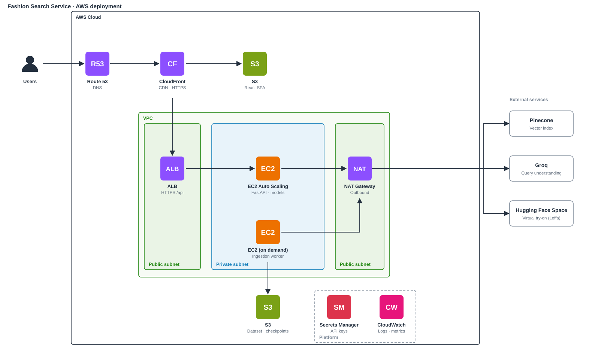

# Fashion Search Service

A semantic fashion product search microservice. It turns a natural-language
query ("I need a dress for a wedding") into ranked products using query
understanding, vector retrieval over Pinecone and cross-encoder reranking.

The service owns one business capability, **product search**, and the
vector index that powers it. It runs as two separate processes from one
codebase:

| Process | Entry point | Lifecycle |
|---|---|---|
| **API** | `uvicorn app.main:app` | Long-running, serves requests |
| **Ingestion worker** | `python -m workers.ingestion_worker` | Offline batch job, resumable, fills the index |

The React app in `frontend/` is a separate client of this API.

## Architecture

Two processes share one codebase (`app/` clients, repositories, domain rules).
The API serves requests; the worker fills the index offline. Pinecone is the
only thing they have in common at runtime.



*Proposed AWS deployment. Today both processes run locally with `uvicorn` and the worker CLI.*

Search flow: the query is understood (regex, then the LLM for fields regex
missed; if Groq is down it falls back to regex only), embedded in one batch,
searched in Pinecone once per gender pool (and per outfit group for outfit
queries, in parallel), reranked in one cross-encoder batch, interleaved and
cut to `top_k`.

Try-on flow: `POST` validates the photo and garment URL and returns a job at
once (202); a background thread calls the Hugging Face Space; the client polls
`GET` for the stage and the final image. Jobs live in memory for 15 minutes.

```
app/
  main.py            app factory, startup (model warm-up), middleware, error handling
  dependencies.py    composition root: builds clients → repositories → services
  api/               HTTP only: router.py, routes/health.py, routes/search.py, routes/tryon.py
  core/              config.py, logging.py, exceptions.py
  schemas/           HTTP request/response contracts
  domain/            Product, SearchFilters, image-selection rule, attribute vocabularies/extractors
  services/          use cases: search, health/readiness, review analysis, product enrichment
  retrieval/         query processing, retriever (gender pools, relaxation), reranker, pipeline
  repositories/      vector_repository (Pinecone schema + filters), dataset_repository (parquet/DuckDB)
  clients/           Pinecone, Groq LLM, embedding, cross-encoder and sentiment models
workers/             ingestion_worker (CLI + loop), batch_processor, checkpoint_manager
scripts/             convert_dataset, check_pinecone, generate_sample_data
tests/unit/          fast tests with in-memory fakes (no network)
tests/integration/   API over HTTP, worker end-to-end, live Pinecone (opt-in)
```

## API

| Method | Path | Purpose |
|---|---|---|
| GET | `/api/health` | Liveness: process is up |
| GET | `/api/ready` | Readiness: models loaded, Pinecone reachable (503 if not) |
| POST | `/api/search` | `{"query": "...", "top_k": 10}` → ranked products |
| POST | `/api/try-on` | multipart `person_image` + `garment_image_url` + `garment_type` → 202 with a job |
| GET | `/api/try-on/{job_id}` | Poll a try-on: `stage`, `queue_position`, and `result_image` (data URL) when done |

**Virtual try-on** runs the [Leffa](https://huggingface.co/spaces/franciszzj/Leffa)
model on a Hugging Face Space (free shared GPU), so nothing heavy runs locally.
Set `HF_TOKEN` (a "Read" token) for a larger free quota. Search results carry
`garment_type` (`upper_body` / `lower_body` / `dresses`, or null for shoes,
hats...), which decides whether a product can be tried on. Photos are cropped
to 3:4 and never stored; jobs and results live in memory for 15 minutes.
`python scripts/try_tryon.py --person me.jpg` tries the Space directly.

Errors return `{"detail", "code", "request_id"}`: 400 invalid request,
422 validation error, 429 too many try-ons, 503 dependency unavailable, 500 internal error. Every
response has an `X-Request-ID` header, which also appears in the logs.

## Setup

```bash
python -m venv .venv
.venv/Scripts/activate          # Windows; use `source .venv/bin/activate` elsewhere
pip install -r requirements-dev.txt
cp .env.example .env            # then set PINECONE_API_KEY (and GROQ_API_KEY, optional)
```

## Running

```bash
# API (http://127.0.0.1:8000/docs)
uvicorn app.main:app --reload

# Ingestion worker
python -m workers.ingestion_worker --dry-run          # count batches only
python -m workers.ingestion_worker --max-batches 2    # small real run
python -m workers.ingestion_worker                    # full run; Ctrl-C safe, rerun to resume
python -m workers.ingestion_worker --only-failed      # retry failed batches

# Tests
pytest                                    # unit + integration (no network)
RUN_LIVE_TESTS=1 pytest tests/integration/vector_db   # against the real index
```

The worker reads `data/metadata.parquet` and `data/reviews.parquet` and
checkpoints to `data/checkpoints/`. Only one batch of reviews is held in
memory at a time.

## Configuration

All settings come from environment variables or `.env`; see `.env.example`.
Only `PINECONE_API_KEY` is required. Without `GROQ_API_KEY`, query
understanding falls back to regex extraction.
