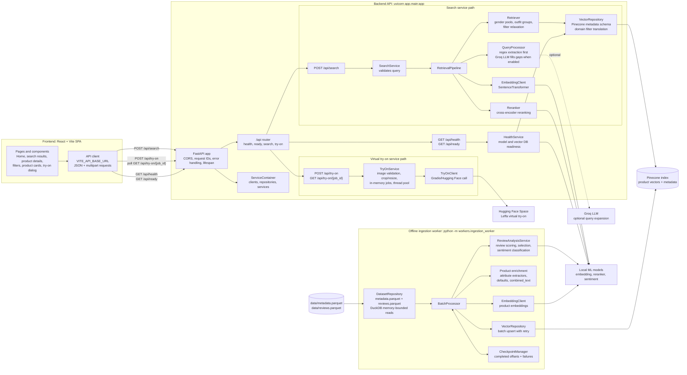

# Fashion Recommendation Architecture

This project is a semantic fashion search and virtual try-on application. It has three main runtime surfaces:

- A React + Vite frontend in `frontend/`.
- A FastAPI backend in `app/`.
- A resumable offline ingestion worker in `workers/`.

The API and the worker share domain rules, model clients, repositories, and configuration from `app/`, but they run as separate processes. Pinecone is the runtime handoff between them: the worker builds the product vector index, and the API searches that index.

## Architecture Diagram



## High-Level Flow

1. The user interacts with the React frontend.
2. Frontend services call the FastAPI backend through `frontend/src/services/apiClient.ts`.
3. The backend routes under `/api` delegate work to service classes created by `app/dependencies.py`.
4. Search requests use local embedding and reranking models plus Pinecone.
5. Try-on requests become short-lived in-memory background jobs that call the external Hugging Face Space.
6. Product data reaches Pinecone through the separate ingestion worker, not through the request-serving API.

## Search Request Flow

1. `frontend/src/services/recommendationApi.ts` sends `POST /api/search` with the natural-language query and optional `top_k`.
2. `app/api/routes/search.py` calls `SearchService.search()`.
3. `SearchService` rejects empty queries and forwards the request to `RetrievalPipeline`.
4. `QueryProcessor` extracts filters from the query:
   - deterministic regex and vocabulary extractors run first;
   - Groq LLM is optional and only fills missing fields;
   - invalid LLM values are discarded because they must match controlled vocabularies.
5. `RetrievalPipeline` creates the search plan:
   - normal queries search one or more gender pools;
   - outfit queries split into garment groups such as tops, bottoms, footwear, and accessories;
   - each group gets its own search text.
6. `EmbeddingClient` embeds the query text or group texts in a batch.
7. `Retriever` performs dense Pinecone searches through `VectorRepository`.
8. Soft filters can be relaxed if too few candidates are returned.
9. `Reranker` scores candidates with a local cross-encoder model.
10. Results are interleaved across gender pools and outfit groups, trimmed to `top_k`, and returned as `SearchResponse`.

## Virtual Try-On Flow

1. The frontend opens the try-on dialog from a product that has a supported `garment_type`.
2. `frontend/src/services/tryOnApi.ts` uploads the user photo and garment URL to `POST /api/try-on`.
3. `TryOnService` validates:
   - supported garment type;
   - upload size;
   - readable image format;
   - HTTPS garment URL from allowed catalog image hosts.
4. The person photo is transformed in memory:
   - EXIF orientation is applied;
   - the image is center-cropped to a 3:4 portrait;
   - it is resized to the model size;
   - it is re-encoded as JPEG, dropping metadata.
5. The API returns `202 Accepted` with a job ID immediately.
6. A background thread calls `TryOnClient`, which talks to the Hugging Face Leffa Space.
7. The frontend polls `GET /api/try-on/{job_id}` until the job is done or failed.
8. Try-on jobs and results are stored only in memory and expire after the configured TTL.

## Ingestion Flow

The ingestion worker is the offline path that builds the searchable catalog.

1. Run the worker with `python -m workers.ingestion_worker`.
2. `DatasetRepository` loads product metadata from `data/metadata.parquet`.
3. Reviews from `data/reviews.parquet` are read per product batch with DuckDB semi-joins, so the full reviews file is not held in memory.
4. `ReviewAnalysisService` scores reviews, selects useful reviews, classifies sentiment, builds review highlights, and aggregates overall product sentiment.
5. Product enrichment merges metadata and review analysis, extracts attributes from titles, applies defaults, and builds `combined_text`.
6. `EmbeddingClient` embeds each product's `combined_text`.
7. `VectorRepository` writes vectors and selected metadata to Pinecone.
8. `CheckpointManager` records completed and failed batch offsets so the worker can resume safely.

## Component Responsibilities

| Area | Path | Responsibility |
|---|---|---|
| Frontend app | `frontend/src` | React pages, reusable UI components, filters, product cards, try-on dialog, API calls. |
| API entry point | `app/main.py` | FastAPI application factory, lifespan, CORS, request IDs, error responses, router mounting. |
| API routes | `app/api/routes` | HTTP boundary only: request/response handling for health, search, and try-on. |
| Composition root | `app/dependencies.py` | Builds clients, repositories, pipeline, and services once per process. |
| Schemas | `app/schemas` | HTTP request and response contracts. |
| Domain | `app/domain` | Product/search/try-on domain objects and fashion attribute extraction rules. |
| Services | `app/services` | Use cases such as search, readiness, virtual try-on, review analysis, and product enrichment. |
| Retrieval | `app/retrieval` | Query understanding, subquery planning, dense retrieval, reranking, interleaving. |
| Repositories | `app/repositories` | Persistence boundaries for Pinecone and local Parquet datasets. |
| Clients | `app/clients` | External or model-specific adapters for Pinecone, Groq, Hugging Face, embeddings, reranking, and sentiment. |
| Worker | `workers` | Offline, resumable batch ingestion into Pinecone. |
| Scripts | `scripts` | Utility scripts for dataset conversion, sample data, Pinecone checks, and direct try-on testing. |
| Tests | `tests` | Unit and integration tests with fakes plus opt-in live Pinecone coverage. |

## Runtime Processes

| Process | Entry point | Main purpose | Shared state |
|---|---|---|---|
| Frontend dev server | `frontend` with `npm run dev` | Browser UI for search, product browsing, and try-on. | Calls API over HTTP. |
| API server | `uvicorn app.main:app --reload` | Serves `/api` requests. | Reads Pinecone index; keeps try-on jobs in memory. |
| Ingestion worker | `python -m workers.ingestion_worker` | Builds and updates the Pinecone index from Parquet data. | Writes Pinecone vectors; writes checkpoint files. |

## External Dependencies

| Dependency | Used by | Purpose |
|---|---|---|
| Pinecone | API and worker | Stores product vectors and searchable metadata. |
| Groq | API search path | Optional LLM query expansion and attribute extraction fallback. |
| Hugging Face Space | API try-on path | Runs the Leffa virtual try-on model. |
| Local SentenceTransformer model | API and worker | Query and product embeddings. |
| Local cross-encoder model | API | Reranks dense-search candidates. |
| Local sentiment model | Worker | Classifies selected reviews during ingestion. |
| DuckDB | Worker | Memory-bounded reads from large Parquet review data. |

## Configuration

Configuration is centralized in `app/core/config.py` and read from environment variables or `.env`.

Important settings include:

- `PINECONE_API_KEY`, `PINECONE_INDEX`, `PINECONE_REGION`
- `GROQ_API_KEY`, `LLM_MODEL`
- `HF_TOKEN`, `TRYON_SPACE`, `TRYON_WORKERS`, `TRYON_JOB_TTL_SECONDS`
- `EMBEDDING_MODEL`, `CROSS_ENCODER_MODEL`, `SENTIMENT_MODEL`
- `METADATA_PATH`, `REVIEWS_PATH`, `BATCH_SIZE`, `CHECKPOINT_PATH`
- `TOP_K`, `DENSE_SEARCH_K`, `OUTFIT_DENSE_K`, `RERANK_CANDIDATES_K`

Only Pinecone is required for normal search readiness. Groq and Hugging Face improve optional capabilities but the code handles missing or unavailable services where possible.

## API Surface

| Method | Path | Description |
|---|---|---|
| `GET` | `/api/health` | Liveness check: confirms the process is running. |
| `GET` | `/api/ready` | Readiness check: verifies required models and Pinecone reachability. |
| `POST` | `/api/search` | Runs semantic product search. |
| `POST` | `/api/try-on` | Starts a virtual try-on job and returns `202 Accepted`. |
| `GET` | `/api/try-on/{job_id}` | Polls try-on progress and final result. |

## Key Design Decisions

- The API and ingestion worker are separate processes so slow batch indexing cannot block live user requests.
- Pinecone is hidden behind `VectorRepository`, keeping database schema and filter translation out of services.
- Query understanding is defensive: deterministic extraction wins, and LLM output is accepted only after validation.
- Dense retrieval and cross-encoder reranking are split so Pinecone handles catalog-scale recall while the local reranker handles fine ranking on a small candidate set.
- Outfit queries become multiple smaller searches so each garment group can be retrieved and reranked with relevant text.
- Try-on uses an asynchronous job model because external image generation is slower than a normal HTTP request.
- Try-on photos are processed in memory and re-encoded to remove EXIF metadata.
- The worker checkpoints every completed batch so interrupted or failed indexing runs can resume.

## Repository Shape

```text
app/
  main.py              FastAPI app factory and middleware
  dependencies.py      composition root
  api/                 routers and route modules
  clients/             Pinecone, Groq, Hugging Face, and local model adapters
  core/                config, logging, application exceptions
  domain/              domain models and fashion attribute rules
  repositories/        Pinecone and dataset persistence boundaries
  retrieval/           search pipeline internals
  schemas/             request and response contracts
  services/            application use cases
frontend/
  src/                 React app, pages, components, hooks, API services
workers/
  ingestion_worker.py  offline indexing CLI
  batch_processor.py   per-batch enrichment, embedding, and upsert
  checkpoint_manager.py
scripts/               utility scripts
tests/                 unit and integration tests
docs/                  architecture diagrams and documentation
```
